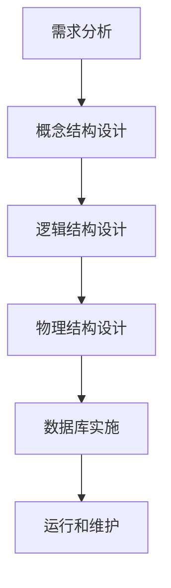

### 1. 知识点

| 阶段 | 主要任务 | 典型成果 |
|---|---|---|
| 需求分析 | 收集需求、确定系统边界 | 需求说明文档、数据字典、数据流图 |
| 概念结构设计 | 抽象实体、属性、联系 | E-R图 |
| 逻辑结构设计 | E-R图转关系模式、规范化 | 关系模式、用户视图、完整性约束 |
| 物理结构设计 | 确定存储结构、索引、存取路径 | 存储方案、索引方案 |
| 实施 | 建库、装入数据、编写应用 | 可运行系统 |
| 运行维护 | 监控、调整、备份恢复 | 维护记录 |

### 2. 流程图



### 3. 例题分析

**例 1**：确定系统边界和关系规范化分别在哪个阶段进行？  
先抓题眼：系统边界属于需求分析；关系规范化属于逻辑结构设计。  
**正确答案**：A（需求分析和逻辑设计）

**例 2**：逻辑结构设计阶段以哪个阶段形成的什么作为设计依据？  
先抓题眼：逻辑设计是在需求分析之后进行，需要需求说明、数据字典和数据流图作为依据。  
**正确答案**：A，C

### 4. 记忆技巧

```text
需求定边界，概念画E-R；
逻辑转关系，物理定存取。
```
