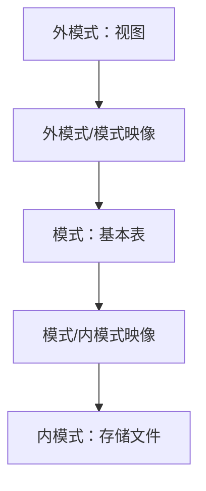

### 1. 知识点

| 层次 | 又称 | 对应对象 | 说明 |
|---|---|---|---|
| 外模式 | 用户模式 / 子模式 | **视图** | 用户看到的数据局部逻辑结构 |
| 模式 | 概念模式 | **基本表** | 数据库全体数据的逻辑结构 |
| 内模式 | 存储模式 | **存储文件** | 数据物理存储结构 |

| 映像 | 连接层次 | 作用 | 对应独立性 |
|---|---|---|---|
| 外模式/模式映像 | 外模式 ↔ 模式 | 用户视图到概念结构的转换 | **逻辑独立性** |
| 模式/内模式映像 | 模式 ↔ 内模式 | 概念结构到物理存储的转换 | **物理独立性** |

> 一个数据库可以有多个外模式，但通常只有一个模式和一个内模式。

### 2. 流程图



### 3. 例题分析

**例 1**：外模式、模式、内模式分别对应什么？  
先抓题眼：三级模式和具体对象的对应。视图是用户看到的局部数据；基本表是逻辑表；存储文件是物理层。  
**正确答案**：B（视图、基本表和存储文件）

**例 2**：物理独立性和逻辑独立性分别通过修改什么映像完成？  
先抓题眼：物理变化在“模式—内模式”之间；逻辑变化在“外模式—模式”之间。  
**正确答案**：D（模式与内模式之间的映像、外模式与模式之间的映像）

### 4. 记忆技巧

```text
外视图，模基表，内文件；
物理往内改，逻辑往外改。
```
